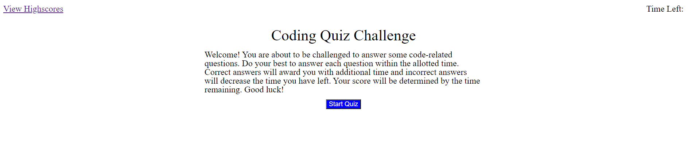
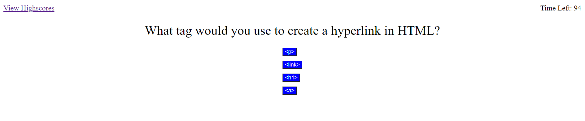

# code_quiz

## 4/1/21

This is a quiz application that will test the user's knowledge with some basic web development questions. There are ten questions and the user will have ten seconds to answer each question. Wrong answers will penalize the user, while correct answers will award more time. Local storage allows the user to save their high scores and then view them in a list. They also have the option to delete all high scores that have been saved.

## Link to Application

https://keddie024.github.io/code_quiz/

## Images of Application

